# MyVista LLM Fabric

A control plane for intelligent LLM serving, routing, evaluation,
observability, and guardrails.

[](https://github.com/officialanubhavbhatia/llm-fabric/actions/workflows/ci.yml)
[](pyproject.toml)
[](docs/assets/observability-pipeline.svg)
[](docs/PROVIDERS.md)

> **Early access.** IntentOS **serving coverage** is required on chat
> (`provider_invocations_without_intent = 0`). Intent-aware **routing** is still
> **OFF** (hard-negative gate not cleared). A license has not been selected —
> treat the tree as all-rights-reserved until the owner publishes
> [`LICENSE`](LICENSE_DECISION.md). Authorship: **Anubhav Bhatia**.

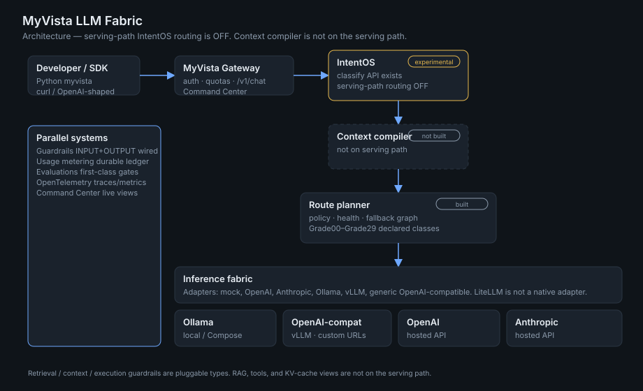

[Quick start](#60-second-quick-start) ·
[Architecture](#architecture) ·
[Command Center](#command-center) ·
[IntentOS](#intentos) ·
[Status](#project-status) ·
[`ARCHITECTURE.md`](ARCHITECTURE.md) ·
[`docs/constitution.md`](docs/constitution.md)

## Contents

1. [What MyVista is](#what-myvista-is)
2. [Command Center](#command-center)
3. [Why MyVista](#why-myvista)
4. [Architecture](#architecture)
5. [60-second quick start](#60-second-quick-start)
6. [IntentOS](#intentos)
7. [Routing](#routing)
8. [Context and cache](#context-and-cache)
9. [Observability](#observability)
10. [Evals](#evals)
11. [Guardrails](#guardrails)
12. [Economics](#economics)
13. [Deployment](#deployment)
14. [Benchmarks](#benchmarks)
15. [SDK](#sdk)
16. [Project status](#project-status)
17. [Roadmap](#roadmap)
18. [Contributing, security, license](#contributing)

---

## What MyVista is

MyVista is an OpenAI-compatible **chat gateway** plus a control plane:

| Built | Not built |
| --- | --- |
| `POST /v1/chat/completions` (buffered + SSE) | Agent runtime, MCP, A2A |
| Identity, tenants, quotas | Public SaaS |
| Policy routing + fallback graph | Intent-aware serving-path **routing** |
| IntentOS **serving coverage** (every invocation has an IntentResult) | IntentOS as a production router |
| Context compiler on the serving path | RAG / tool execution |
| Durable usage events | Billing-grade exactly-once accounting |
| Command Center + OTEL | Conversation threads / batch-utilization scrape |
| vLLM `/metrics` scrape when configured | KV metrics on Ollama |
| Eval gates | Agent and safety eval suites |
| INPUT + OUTPUT guardrails on chat | CONTEXT/RETRIEVAL/EXECUTION guardrail stages unbound |

It is not an agent platform, a RAG system, or a model trainer.

---

## Command Center

The dashboard is served by the gateway at `/command-center`.

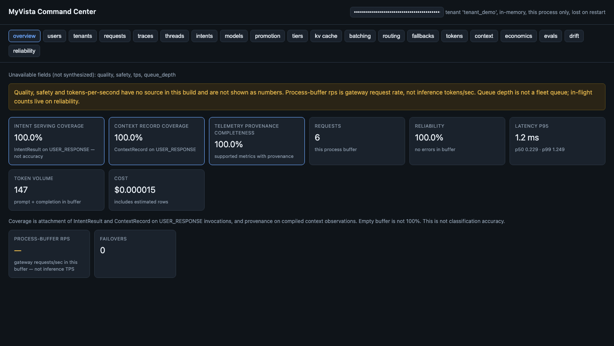

This screenshot is a **real capture** of the running UI after SDK demo traffic
(`tenant_demo` / `user_demo` / `project_demo`, `auth_mode=dev`, in-process
meter). Numbers are that process's meter, not a production SLA. Unavailable
fields are listed in the UI instead of being synthesized.

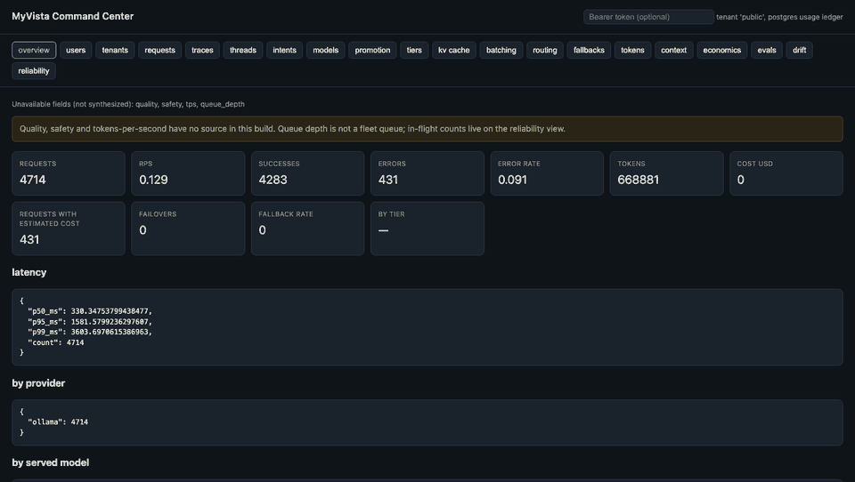

The GIF is a walk through **real** views after API/SDK traffic, not a mocked UI.
How to refresh it: [`docs/README_DEMO.md`](docs/README_DEMO.md).

**Live views:** overview, users, tenants, requests, traces, intents, models,
promotion, tiers, routing, fallbacks, tokens, context, kv_cache, economics,
evals, drift, reliability.

**Present but not backed:** threads, batching — the UI says so.

Overview cards that have a source: Intent serving coverage, Context record
coverage, telemetry provenance completeness, requests, reliability, latency,
token volume, cost. Quality, safety, and a single TPS number are **not** shown
as measurements.

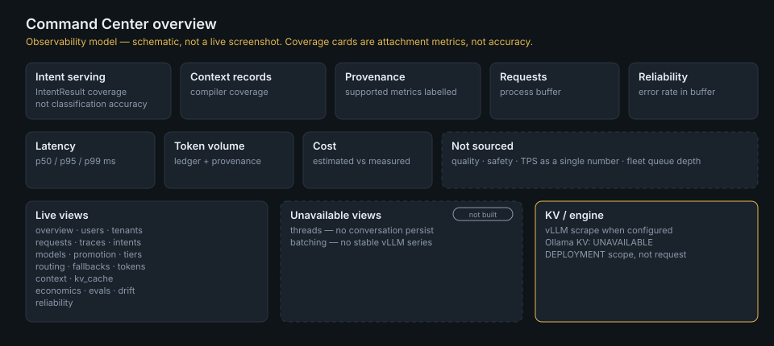

---

## Why MyVista

A comparison of **concepts**, not a competitor benchmark.

| Typical LLM proxy | MyVista |
| --- | --- |
| Provider forwarding | Policy-based routing + health-aware fallback |
| Request logs | Traces, usage ledger, Command Center |
| Static fallback list | Directed fallback graph + circuit breakers |
| Prompt-only heuristics | Hierarchical IntentOS on the serving path (**coverage**; routing OFF) |
| Token counts in the response | Durable invocation ledger (not billing-grade) |
| Process liveness | Dependency-aware admission (`/readyz`) |
| Unit tests | Eval gates on the change itself |

LiteLLM is **not** a rival in this table. It is a first-class **transport**
adapter: MyVista's Route Planner still selects the deployment. Direct Ollama
and direct vLLM remain valid without LiteLLM.

---

## Architecture


```
Client/SDK
        ↓
MyVista
  Auth
  Tenant
  Guardrails
  IntentOS REQUIRED
  Context Compiler REQUIRED
  Route Planner
        ↓
 ┌───────────────┬───────────────────┐
 │               │                   │
Ollama        LiteLLM             vLLM direct
                 │
          ┌──────┼──────────┐
          │      │          │
       Ollama   vLLM    External
```

LiteLLM is **transport**, not an inference engine. Direct Ollama and direct vLLM
remain valid without it.

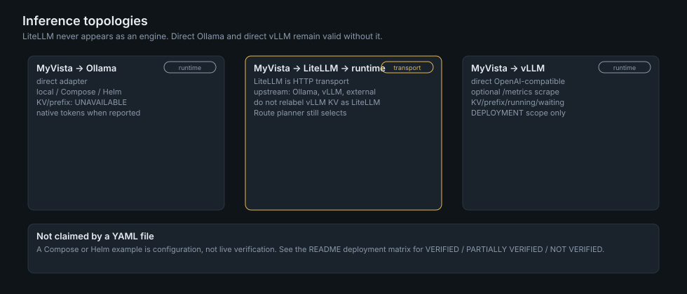

IntentOS classification also remains a **separate API**. The context compiler
**is on the serving path**. Details: [`ARCHITECTURE.md`](ARCHITECTURE.md) and
[`docs/CONTEXT.md`](docs/CONTEXT.md).

---

## 60-second quick start

Mock provider. No API keys. Docker Compose profile `mock`.

```bash
git clone https://github.com/officialanubhavbhatia/llm-fabric.git
cd llm-fabric

make docker-up
make docker-test
```

Gateway: [http://127.0.0.1:47317](http://127.0.0.1:47317) · Command Center:
[http://127.0.0.1:47317/command-center](http://127.0.0.1:47317/command-center)

```bash
curl -sS http://127.0.0.1:47317/v1/chat/completions \
  -H 'content-type: application/json' \
  -d '{"model":"auto","messages":[{"role":"user","content":"Say hello in one sentence."}]}'
```

`make docker-up` is the Compose mock stack. It does **not** require a local
`.env`. A local (non-Compose) process does:

```bash
cp .env.example .env
export LLM_FABRIC_ENVIRONMENT=development   # required; unset refuses to start
make dev
```

Ollama on Docker Desktop: `make docker-desktop-ollama`, then
`make ollama-pull` or `make ollama-pull-grades`. Grade00–Grade29 are a **declared
size/family ladder**, not a quality ranking.

LiteLLM in front of Ollama (no Kubernetes): `make docker-litellm-ollama` or
`make docker-desktop-litellm-ollama`. LiteLLM is Compose-internal; it is not a
public ingress.

---

## IntentOS

Hierarchical classification: exact cache → semantic cache → rules → embedding,
then optional L4, then abstain. **Every provider invocation carries an
IntentResult** (known / unknown / abstain / `SAFE_FALLBACK`). That is **100%
IntentOS serving coverage** on the chat path
(`provider_invocations_without_intent = 0`). It is **not** 100% classification
accuracy.

**Serving-path routing is OFF** because the hard-negative gate has not cleared.

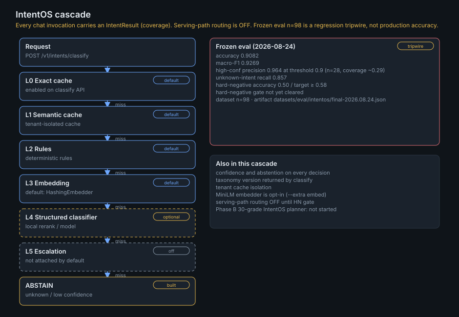

Classify without changing chat routing:

```python
from myvista import MyVista

client = MyVista()  # http://127.0.0.1:47317
result = client.intents.classify("Write a Python function that reverses a list.")
print(result["classification"]["intent_id"], result["classification"]["confidence"])
```

### IntentOS v1 evaluation

Source: [`datasets/eval/intentos/final-2026.08.24.json`](datasets/eval/intentos/final-2026.08.24.json).
Self-authored bootstrap set, **n=98**. A regression tripwire, not production
quality. No comparison against another classifier has been run.

| Metric | Value |
| --- | --- |
| Accuracy | 0.9082 |
| Macro F1 | 0.9269 |
| High-confidence precision (threshold 0.9, n=28, coverage ~0.29) | 0.964 |
| Unknown-intent recall | 0.857 |
| Hard-negative accuracy | **0.50** / target **≥ 0.58** |
| Hard-negative gate | **not cleared** |

Default embedder is HashingEmbedder. MiniLM is opt-in (`--extra embed`). L4 is
experimental and off by default. L5 is not attached by default. Phase B 30-grade
IntentOS routing has **not started**.

Write-up: [`docs/EVALUATIONS.md`](docs/EVALUATIONS.md).

---

## Routing

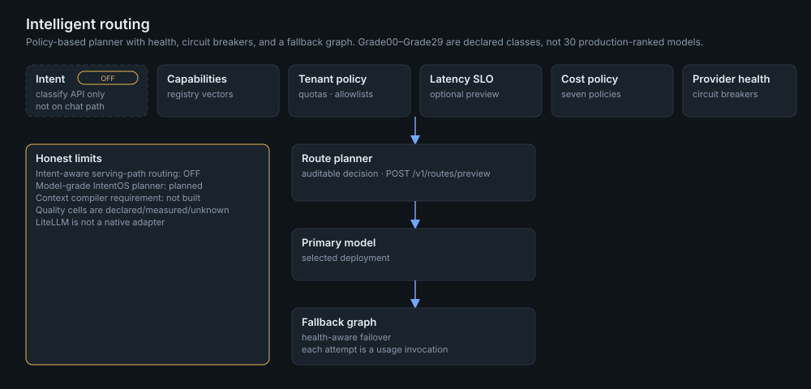

The planner takes capabilities, tenant policy, optional latency/cost policy, and
provider health, then selects a primary model and may walk a fallback graph.
Each attempt is a usage invocation.

`POST /v1/routes/preview` explains a decision **without** calling a provider.

Grade00–Grade29 exist as **declared classes** in the registry. That is not 30
production-ranked models and not IntentOS-driven grade selection.

---

## Context and cache

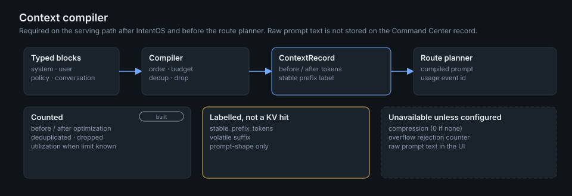

| Mechanism | Status |
| --- | --- |
| Context compiler | **On the serving path.** **100% context record coverage** (`provider_invocations_without_context_record = 0`). |
| Supported telemetry provenance | **100%** on compiled ContextRecord observations (`supported_metrics_without_provenance = 0`). |
| Response / KV inference cache | Not a request-level cache. vLLM KV is a **DEPLOYMENT** scrape when configured. |
| Continuous batching scrape | **Not built** (no stable batch-utilization series in the catalog this tree parses). |
| Intent L0/L1 caches | Built on classify and on serving-path classification when enabled. |

`stable_prefix_tokens` labels prompt shape. It is not a vLLM prefix-cache hit.

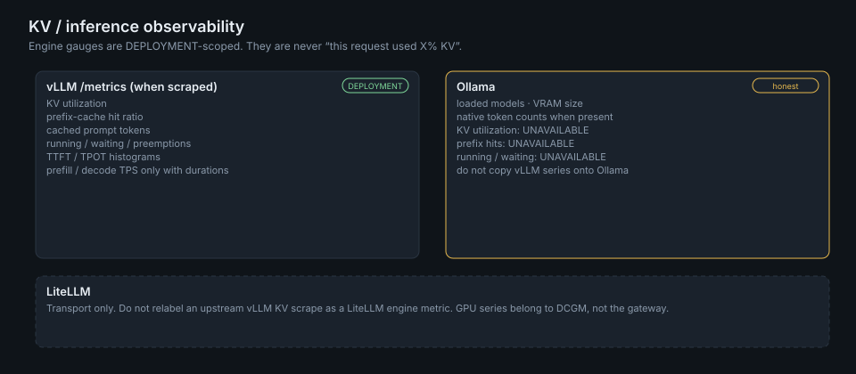

---

## Observability

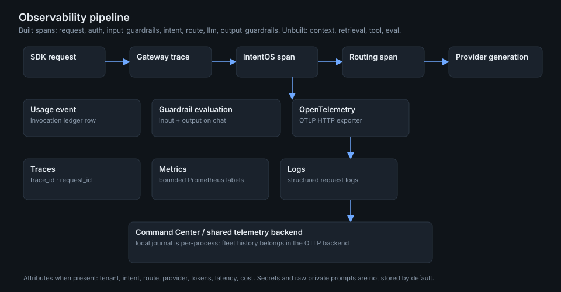

Built spans: `request`, `auth`, `input_guardrails`, `intent`, `context`, `route`,
`litellm`, `llm`, `output_guardrails`, `usage`. Unbuilt as serving spans:
`retrieval`, `tool`, `eval`.

The Command Center trace journal is **per process** and lost on restart. Fleet
history belongs in an OTLP backend (`LLM_FABRIC_OTEL_EXPORTER_OTLP_ENDPOINT`).
Prometheus cardinality is bounded. Secrets and raw private prompts are not
stored by default.

---

## Evals

Evals are first-class. They do not mean every AI behaviour is solved.

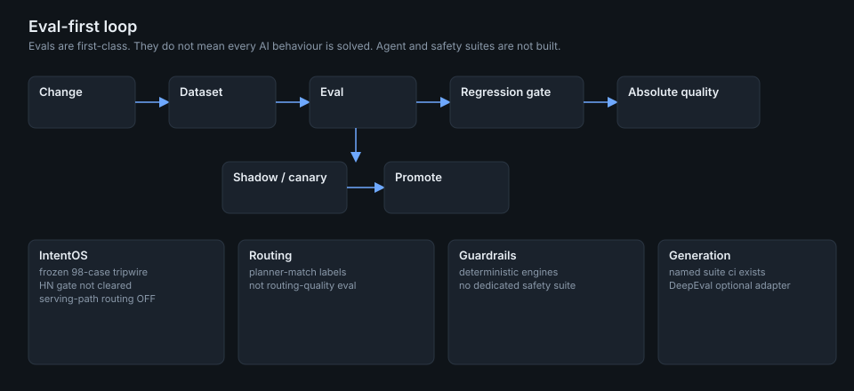

`llm-fabric-eval` runs suites, comparisons, and gates. The named SDK suite is
`ci`. DeepEval and lm-evaluation-harness are optional adapters and report
unavailable when the extra is missing. Agent and safety suites are **not**
built. IntentOS numbers remain the bootstrap tripwire above.

---

## Guardrails

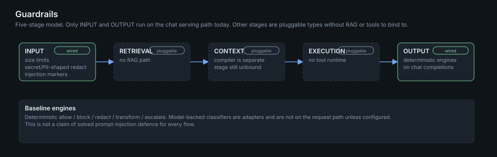

Stages exist as types: INPUT → RETRIEVAL → CONTEXT → EXECUTION → OUTPUT.
**INPUT and OUTPUT are wired on chat completions** (size, secret/PII-shaped
redact, injection markers). RETRIEVAL, CONTEXT, and EXECUTION are **pluggable**
— there is no RAG or tool runtime on the serving path to bind them to.

---

## Economics

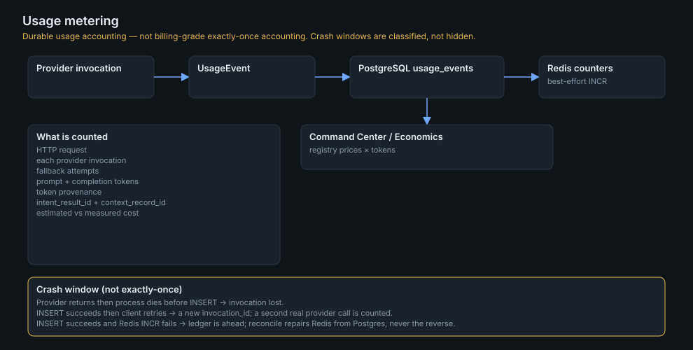

Provider invocation → `UsageEvent` → PostgreSQL `usage_events` → Redis
best-effort counters → Command Center / Economics.

Counted: request, each invocation (including fallbacks), prompt/completion
tokens, token provenance, estimated vs measured cost (registry price × tokens).

This is **durable usage accounting**, not billing-grade exactly-once accounting.
If the process dies after the provider returns and before INSERT, that
invocation is lost. See [`docs/USAGE_METERING.md`](docs/USAGE_METERING.md).

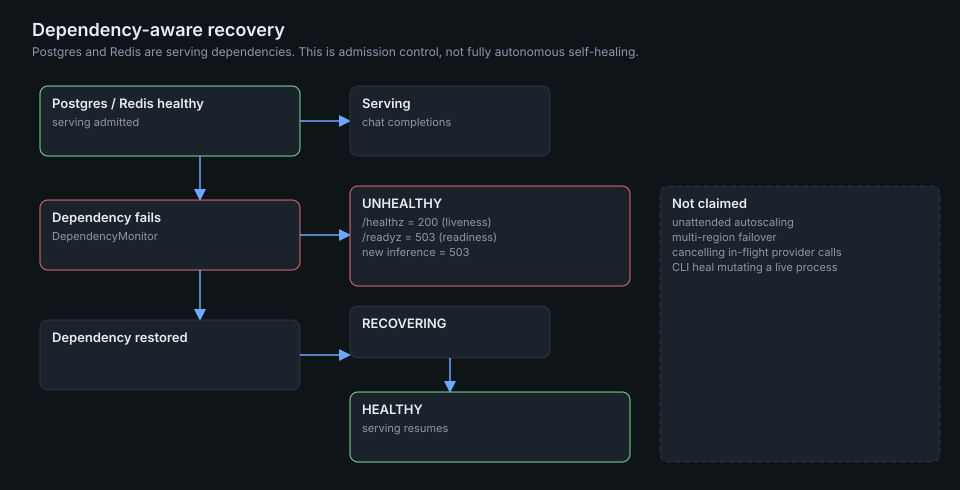

When PostgreSQL or Redis is a required serving dependency and is down:
`/healthz` stays 200, `/readyz` is 503, **new** inference is 503. In-flight
provider calls are not cancelled. This is **dependency-aware recovery**, not
fully autonomous self-healing.

---

## Deployment

Status words mean live evidence, not “a values file exists”.

| Topology | Status | Evidence |
| --- | --- | --- |
| Local MyVista → Ollama | **PARTIALLY VERIFIED** | `make dev-ollama` / Desktop Compose. Live model pull and chat are operator steps. |
| Local MyVista → LiteLLM → Ollama | **PARTIALLY VERIFIED** | `make docker-litellm-ollama` / `make docker-desktop-litellm-ollama`. Live chat is an operator step. |
| Docker MyVista → Ollama | **PARTIALLY VERIFIED** | Compose `local` profile: stack-up yes; pull/chat is an operator step. |
| Docker MyVista → LiteLLM → Ollama | **PARTIALLY VERIFIED** | Compose `litellm-ollama`. Manifest yes; live chat is an operator step. |
| Docker Compose mock | **VERIFIED** | `make docker-up` / `make docker-test`, 2026-08-24. Mock provider, not a model SLA. |
| K8s MyVista → Ollama | **PARTIALLY VERIFIED** | Helm `local-ollama-values.yaml` + `make k8s-local-ollama-up`. kind smoke on 2026-08-24 used the **mock** chart (`local-values.yaml`), not a live Ollama chat. |
| K8s MyVista → LiteLLM → Ollama | **NOT VERIFIED** | Helm example `local-litellm-ollama-values.yaml` exists. No live chat evidence in this tree. |
| Direct vLLM | **NOT VERIFIED** | Adapter and `/metrics` parser exist. No GPU live scrape claimed here. |
| LiteLLM → vLLM | **NOT VERIFIED** | Compose `litellm-vllm` manifest yes; **PENDING** without a real GPU / `VLLM_API_BASE`. |
| Kubernetes + Helm (kind mock) | **VERIFIED** | `make k8s-local-test`, 2026-08-24, mock chat + Command Center. |
| HPA autoscaling | **NOT VERIFIED** | Disabled in chart values. |
| AKS / EKS / GKE examples | **NOT VERIFIED** | Helm-rendered, **not** live-tested. |

Production path that **has** been reviewed: controlled internal single-VPC
Kubernetes, managed PostgreSQL + Redis, API-key or OIDC, autoscaling **off**.
Verdict and limits: [`PRODUCTION_READINESS.md`](PRODUCTION_READINESS.md).

Production path that **has** been reviewed: controlled internal single-VPC
Kubernetes, managed PostgreSQL + Redis, API-key or OIDC, autoscaling **off**.
Verdict and limits: [`PRODUCTION_READINESS.md`](PRODUCTION_READINESS.md).

---

## Benchmarks

These families are **not interchangeable**. Mock gateway RPS is not model
inference. Prefill TPS is not decode TPS.

| Family | What it measures | This README |
| --- | --- | --- |
| Gateway RPS | HTTP `POST /v1/chat/completions` through the fabric | Historical mock figure below |
| Inference requests/sec | Completed generations at a real runtime | **Not claimed** here |
| Prefill TPS | Prompt tokens / prefill duration | **Not claimed** (needs runtime duration) |
| Decode TPS | Completion tokens / decode duration | **Not claimed** (needs runtime duration) |
| TTFT | Time to first token | Gateway streaming when measured; not a mock SLA |
| TPOT | Time per output token | Gateway streaming when measured; not a mock SLA |

**Historical gateway benchmark — NOT inference throughput.** Mock provider,
Compose production-like stack, 2026-08-24.

| | |
| --- | --- |
| Result | **237 req/s**, 1920 requests, 0 errors |
| Latency | p50 132.34 ms · p95 168.15 ms · p99 221.26 ms |
| Artifact | [`artifacts/audit-2026-08-24/load-chat-short.json`](artifacts/audit-2026-08-24/load-chat-short.json) |
| Command | `uv run llm-fabric-load --host 127.0.0.1 --port 47317 --workload chat-short --duration 8 --warmup 2 --connections 32 --processes 2` |

Historical 1,000 req/s and 2,377 req/s figures are **not** this release's claim
and are **not** inference RPS. Ollama token throughput is not a currently
reproduced product SLA in [`docs/BENCHMARKS.md`](docs/BENCHMARKS.md).

---

## SDK

In-tree package `myvista` (installed by `uv sync`). Default base URL is `http://127.0.0.1:47317`.

```python
from myvista import MyVista

client = MyVista()

chat = client.chat.completions.create(
    model="auto",
    messages=[{"role": "user", "content": "Say hello in one sentence."}],
)
print(chat.text, chat.fabric.served_model, chat.usage)

classified = client.intents.classify("Write a Python function that reverses a list.")
print(classified["classification"]["intent_id"])

traces = client.traces.list()
print(traces.keys())
```

Embeddings and agents raise `UnsupportedError`. TypeScript client:
`sdk/typescript`. Contract: [`docs/CONTRACT.md`](docs/CONTRACT.md).

---

## Project status

### Early access

### Verified

- Serving-path contract (unit/contract tests on this tree):
  `provider_invocations_without_intent = 0`,
  `provider_invocations_without_context_record = 0`,
  `supported_metrics_without_provenance = 0`
- Controlled internal single-VPC Kubernetes (see production-readiness doc)
- PostgreSQL usage ledger and Redis quotas when configured
- OAuth2/OIDC and API keys (production refuses to start without auth)
- Tenant isolation tests
- Durable usage events
- Dependency-aware readiness

### Not claimed

- Public SaaS readiness
- Multi-region HA
- Billing-grade accounting
- Unattended autoscaling
- 1,000 RPS real-model SLA
- 1,000 inference requests/sec
- 100% IntentOS **accuracy**
- 100% KV metrics on Ollama
- Solved prompt injection on every flow
- IntentOS as a production router

---

## Roadmap

Planned work, not a schedule:

- IntentOS hard-negative gate, then serving-path **routing**
- Phase B 30-grade IntentOS planner
- Verified HPA
- License selection by the owner

---

## Contributing

See [`CONTRIBUTING.md`](CONTRIBUTING.md). `make check` is the local gate.

### Security

Report privately via GitHub security advisories. See [`SECURITY.md`](SECURITY.md).

### License

None selected. All rights reserved until the owner publishes `LICENSE`.
[`LICENSE_DECISION.md`](LICENSE_DECISION.md).

### Deeper docs

[`ARCHITECTURE.md`](ARCHITECTURE.md) ·
[`docs/constitution.md`](docs/constitution.md) ·
[`docs/CONFIGURATION.md`](docs/CONFIGURATION.md) ·
[`docs/PROVIDERS.md`](docs/PROVIDERS.md) ·
[`docs/BENCHMARKS.md`](docs/BENCHMARKS.md) ·
[`docs/EVALUATIONS.md`](docs/EVALUATIONS.md) ·
[`docs/deployment/README.md`](docs/deployment/README.md) ·
[`docs/README_DEMO.md`](docs/README_DEMO.md)
